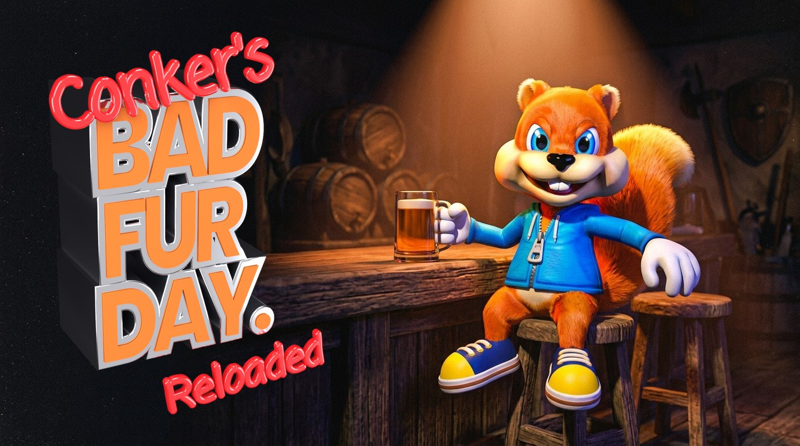
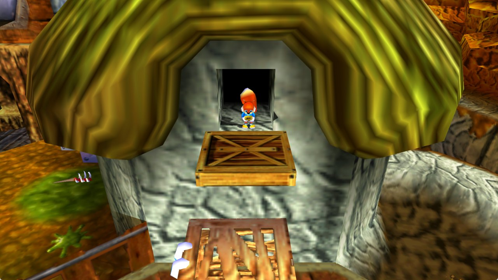
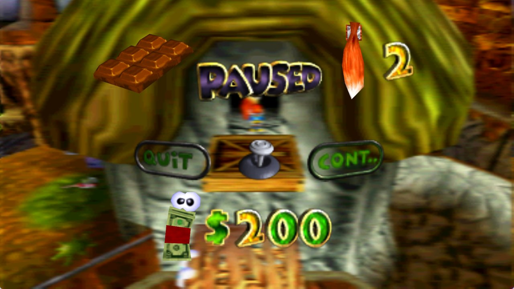
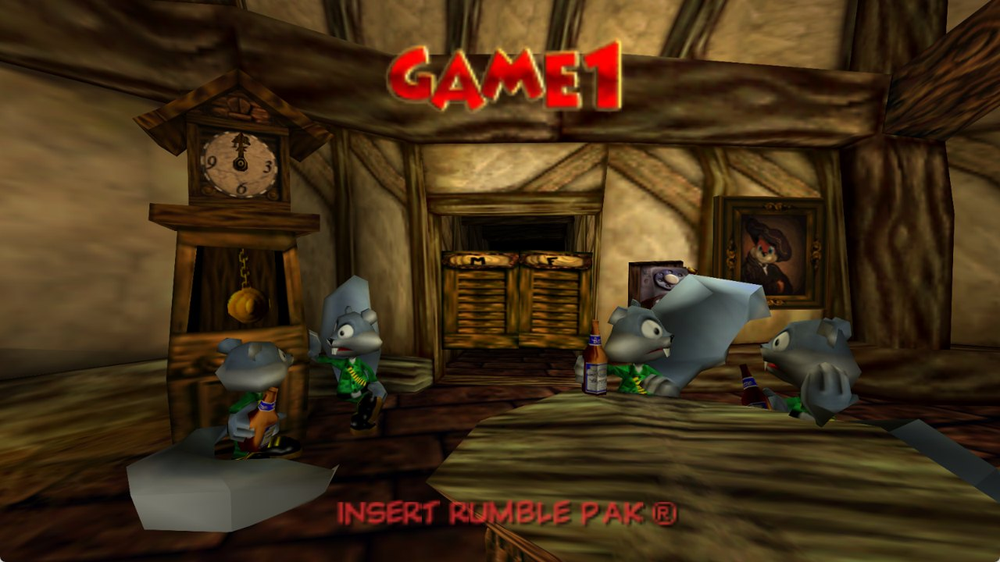
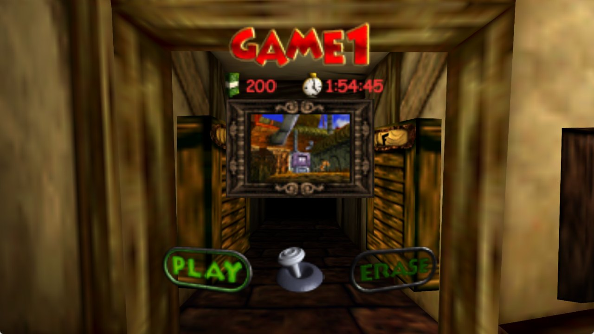
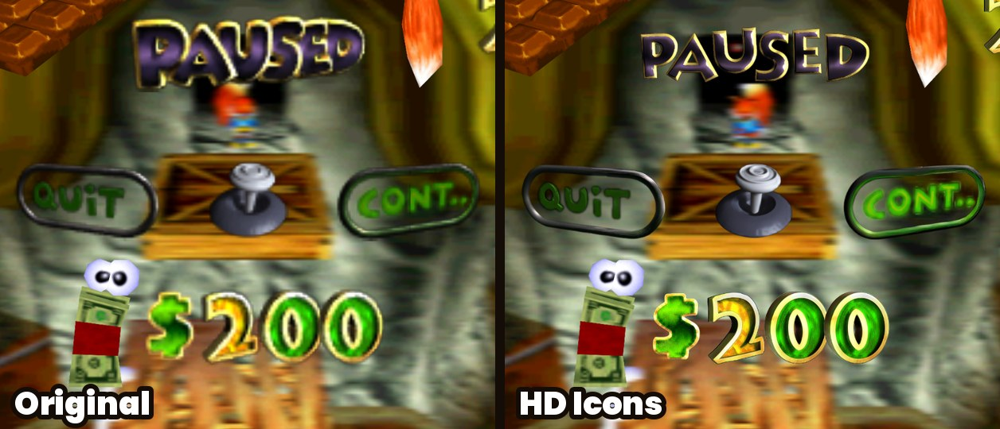

  

# Conker's Bad Fur Day: Reloaded

Conker's Bad Fur Day running natively on PC. It isn't an emulator: the original N64 game was
statically recompiled with [N64Recomp](https://github.com/N64Recomp/N64Recomp) into a real
Windows (and Linux) program, so it runs at full speed with modern graphics, widescreen and proper
mouse and controller support.

I wanted two things out of this. First, a version of Conker that feels at home on a modern PC:
widescreen with no black bars, a smooth frame rate, a free camera, sharper graphics. Second, for
anyone who just wants to play it the way it was in 2001, a **Classic** mode that stays as close to
the N64 as possible, only cleaner. One click on the Conker tab switches between the two, and you
can mix and match anything in between.

**You need your own copy of the game.** No game files are included. You'll need the US ROM
(`Conker's Bad Fur Day (USA).z64`, SHA-1 `4cbadd3c4e0729dec46af64ad018050eada4f47a`).

   
   

## Getting started

1. Grab the latest build from the [Releases](../../releases) page: the `Windows.zip` or the
   `Linux.tar.gz`.
2. Unzip it anywhere and run `ConkerBFDReloaded` (`.exe` on Windows).
3. The first time, it asks for your ROM. After that it remembers it. (To use another one later,
   such as the uncensored ROM hack, use **ROM** in the launcher.)
4. Open the settings, go to the **Conker** tab and pick **Classic** or **Modern**.

That's it. Your settings and saves live in `%LOCALAPPDATA%\ConkerBFDReloaded` on Windows and in
`~/.config/ConkerBFDReloaded` on Linux.

Got a save from an emulator? An N64 EEPROM save (a `.eep` from Project64, for example) works as it
is: copy it into the `saves` folder there as `conker.n64.us.1.0.bin`, replacing the one that's
there (back that one up first).

**Windows:** Windows 10 or 11, 64-bit, with a graphics card that supports DirectX 12 or Vulkan.

**Linux:** a 64-bit distro from roughly 2022 onwards (glibc 2.35 or newer, e.g. Ubuntu 22.04+,
Fedora 36+, Debian 12+), a Vulkan graphics driver, and SDL2, GTK 3 and FreeType installed (most
desktops already have them). If the ROM picker doesn't show up, start it once from a terminal
with `./ConkerBFDReloaded --rom /path/to/conker.z64`. It's remembered after that.

## Classic or Modern

**Classic** is the N64 experience: the original 4:3 picture, the original 30 fps, the game's own
camera, the original lighting and shading. You get the higher resolution and nothing else changes.

**Modern** turns on widescreen, the smooth frame rate, sharper 2D graphics, smooth shading, the
free camera, the aiming crosshair, the autosave icon, hold-to-skip cutscenes,
pausing when you alt-tab, Skip Intro and direct mouse aiming.

While Classic or Modern is picked, the settings it decides are greyed out. Pick **Custom** to
change any of them yourself.

## What's in it

### Made for this project

- **Widescreen with no black bars.** Gameplay, menus, the pause screen and the intro all fill the
  screen edge to edge. Where the original framed a shot for 4:3 (like the opening lamp scene),
  the camera is adjusted so nothing important gets cut off. I didn't put bars back in.
- **A proper widescreen pause screen.** On the N64 the pause menu shows a blurred copy of the last
  frame. Here that copy is taken in widescreen too, and the thin lines that used to show up
  through it are gone.
- **Accurate lighting.** I compared the lighting against an accurate N64 emulator scene by scene and
  fixed how torches and other point lights fall off with distance. Dark rooms like the throne
  room now look the way they should.
- **Shiny reflections fixed.** Things like the gold Rareware logo in the intro and the bottles in the
  bar have their proper reflective look back.
- **Separate Music, Sound Effects and Speech volumes.** Want to hear the dialogue over the music?
  Now you can.
- **Skip Intro.** Straight to the bar menu in a couple of seconds.
- **Classic / Modern / Custom presets**, as described above.
- **Aiming crosshair.** A red dot shows where a throw will land when Conker aims (the knives in
  the barn, throwables, the magnum). It's lined up with where the game actually throws, and it
  stays out of the way when you just hold R to look around. The original has none.
- **Autosave icon.** A little Conker head in the corner while the game saves, like modern games.
- **Show Cash.** Your cash on screen during play, drawn exactly like the pause screen's (the wad of
  bills with eyes and the gold numbers), in the top-right corner. It counts up or down with a little
  animation when your cash changes. Show it only when it changes, or all the time.
- **Hold to skip cutscenes.** Hold L to skip any cutscene, even the first time you see it and the
  ones the original never lets you skip. A ring fills while you hold, so you can't skip by accident.
- **Free camera.** Turn the camera with the right stick, or the mouse too (Free Camera on the
  General tab), and it stays where you put it. It doesn't go through walls, posts or the floor:
  where there's no room it comes in toward Conker, and it glides back out when there's space.
  Tilted down, it settles just above the ground.
- **An Accessibility tab:** press R or Z once to look around or crouch instead of holding them,
  walk instead of run with L, catch the edge when you walk off something high, swim up by pushing up
  underwater, turn off the motion blur, keep your health and cash on screen, make the tail spin last
  longer, and pause the game when you alt-tab.
- **Clean menu pictures.** Buttons and titles in the menus are made of small pieces, and at high
  resolutions you could see thin lines where they met (PLAY, PAUSED and so on). They're joined
  smoothly now.
- **Works with the uncensored ROM hack.** ROM hacks that only change the game's data, like the
  uncensored speech, are accepted. Pick one with the **ROM** option in the launcher, which also shows
  which one you're playing (Original or Uncensored) and switches back any time.
- **Texture pack and mod support.** RT64 texture packs (`.rtz`) and N64Recomp mods (`.nrm`) go in
  through the Mods menu and can be switched on and off while you play.

### Experimental

These are my own additions that work, but haven't been tested everywhere yet. If something looks or
feels off, please [open an issue](../../issues). That's exactly the feedback I'm after.

- **Smooth shading.** Lighting worked out per pixel instead of per corner, so torch light looks
  round and soft. I checked that it matches the original's brightness in the areas I tested,
  but not across the whole game.
- **The crosshair with other weapons.** It's lined up and tested with the knives in the barn. With
  other throwables and the magnum it sits in the middle of the screen, which I haven't checked yet.
- **Light glows near the screen edges.** In widescreen they used to vanish toward the sides; they
  should stay now, but I haven't seen one in-game yet.
- **Frame rates above 60.** Smooth 60 fps is tested. I couldn't test 120 Hz and up because I don't
  have a screen that goes that high.
- **Linux build.** It builds and runs the game at full speed, and draws correctly, but I've only
  run it inside WSL on Windows with software graphics. Real Linux hardware, controllers and sound
  are untested. Please report how it goes.

### From CBFD-Recompiled

A lot of great work came from [CBFD-Recompiled](https://github.com/sciaschi/CBFD-Recompiled) by
Sean Ciaschi, and it's included here with credit. That covers mouse and gyro aiming, rumble
options, camera turning speed and invert, a Field of View setting, a frame rate counter, built-in
support for N64 controllers and adapters (raphnet, Mayflash, Hyperkin, the Switch Online N64
controller, the 8BitDo 64), multiple controllers for multiplayer, binding mouse buttons, and a long
list of fixes (the sky crash on wide screens, doors clipping in widescreen, the drunk-effect smear,
cutscene camera cuts, speech bubbles, light glows, the wrong music playing after a game over or in
the stone dragon's mouth, and more). Files taken from their project say so at the top.

## HD Icons texture pack

An optional pack that makes the 2D pictures sharp: the HUD, the pause screen, menu buttons and
titles, the bar's signs, chapter names, the legal screen's text and logos. It's built from
GameBeast92's 4K Ultimate Texture Pack, but wherever that pack recoloured or redrew something,
the original game's colours and shapes are put back, so it still looks like Conker, just sharper.

To install it, download `ConkerBFDReloaded-HD-Icons` (`.rtz`) from the [Releases](../../releases)
page, then in the game open the settings, go to **Mods**, click **Install Mods** and pick the file.
You can switch it on and off there any time, even while playing.

Textures by [GameBeast92](https://github.com/GameBeast92/Conker-s-Bad-Fur-Day-4k-Ultimate-Texture-Pack),
used and modified under [CC BY 4.0](https://creativecommons.org/licenses/by/4.0/). The pack is
shared under the same license, and the `LICENSE.txt` inside it lists what was changed.

## Known issues

- **The free camera stays out of fixed-camera spots.** Places where the game uses a fixed camera
  (some doorways, the Windy barn) keep it. That's on purpose.
- **Controls feel like the original.** The game still runs its logic at 30 fps like on the N64. The
  smooth frame rate makes it look smoother, but Conker handles exactly the way he always did.
- **No macOS build yet.**

## Coming next

I'm looking into a 2D minimap.

## Building it yourself

You need the ROM in this folder as `conker.z64`, the [mkst/conker](https://github.com/mkst/conker)
decompilation (commit `3adf229`) built into `conker/`, and
[N64Recomp](https://github.com/N64Recomp/N64Recomp) (commit `ffb39cd`, with
`patches/n64recomp.patch` then `patches/n64recomp_conker.patch` applied) built into `N64Recomp/`.

1. `tools/prepare_game.sh` prepares the game code for translation.
2. `tools/rebuild_all.sh --force` translates it (into `recomp/out`). On Windows (with WSL for
   this step), it also builds `ConkerBFDReloaded.exe` with Visual Studio 2022, CMake and Ninja,
   after `host/setup_deps.bat` has fetched the dependencies.
3. On Linux: `tools/setup_deps.sh` fetches and patches the dependencies, then
   `tools/build_linux.sh` builds it (GCC 13+ or Clang, CMake, Ninja, and the SDL2, GTK 3,
   FreeType, X11 and Vulkan development packages).

| Folder     | What's in it |
|------------|--------------|
| `host/`    | The program itself: source in `src/`, menu art and fonts in `assets/`, Windows build scripts. |
| `recomp/`  | How the game gets translated: `conker.toml` (N64Recomp settings and hooks). |
| `patches/` | Changes to N64Recomp, N64ModernRuntime, RT64 and RecompFrontend. |
| `tools/`   | Build scripts, texture pack tools (`textures/`) and test tools (`testing/`). |

## Credits

Made by **dahmedvall95**.

None of this would exist without the people whose work it's built on:

- **[CBFD-Recompiled](https://github.com/sciaschi/CBFD-Recompiled)** by Sean Ciaschi (MIT, see
  `recomp/THIRD_PARTY_LICENSE`). Many fixes and features are theirs.
- **[mkst/conker](https://github.com/mkst/conker)**, the Conker decompilation.
- **[N64Recomp, N64ModernRuntime and RecompFrontend](https://github.com/N64Recomp)** by Wiseguy
  and contributors.
- **[RT64](https://github.com/rt64/rt64)** by Darío and contributors, the renderer.
- **[GameBeast92's 4K Ultimate Texture Pack](https://github.com/GameBeast92/Conker-s-Bad-Fur-Day-4k-Ultimate-Texture-Pack)**
  (CC BY 4.0), the textures behind the optional HD Icons pack.
- GLideN64 and Rice Video, whose texture fingerprints are how texture packs get matched.
- Fonts: Inter, Noto Emoji, Luckiest Guy, Coming Soon, Poppins (SIL Open Font License) and
  PromptFont.

## License

The code in this repository is under the MIT License (see `LICENSE`), and the parts from other
projects keep their own licenses, noted in the files. The program you download, though, includes
[N64ModernRuntime](https://github.com/N64Recomp/N64ModernRuntime), which is under the GPL-3.0, so
the released program as a whole is distributed under the GPL-3.0. Its full source is right here.
The release's `LICENSE` file has all of the details.

*Conker's Bad Fur Day* is © Rare / Microsoft. This is a fan project, not affiliated with or
endorsed by them, and it doesn't include any of the game's data.
